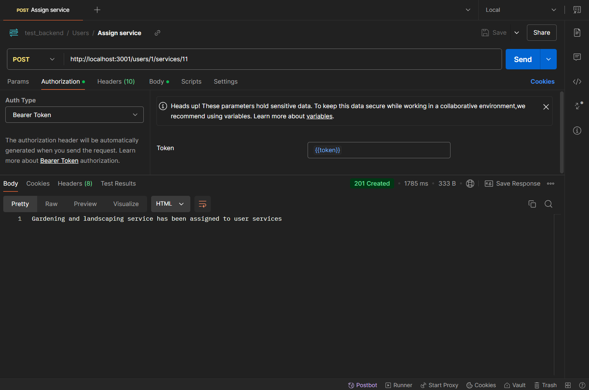

# Test Backend

A backend application built with Node.js, NestJS, TypeScript, PostgreSQL and TypeORM designed to provide various functionalities to manage users and services allowing to assign them to a multiple users.

## Table of Contents

- [Test Backend](#test-backend)
  - [Table of Contents](#table-of-contents)
  - [Features](#features)
  - [Technologies Used](#technologies-used)
  - [Installation](#installation)
  - [Usage](#usage)
  - [Environment](#environment)
  - [API Endpoints](#api-endpoints)
  - [Testing](#testing)
  - [Screenshots](#screenshots)
  - [Contributing](#contributing)

## Features

- User authentication
- Role-protected routes
- User and service management
- Comprehensive API documentation through Swagger for easy integration and understanding of endpoints.

## Technologies Used

- **TypeScript**: A typed superset of Javascript that compiles to plain Javascript.
- **NestJS**: A progressive Node.js framework for building efficient and scalable server-side applications.
- **TypeORM**: A traditional ORM which maps tables to model classes.
- **PostgreSQL**: Relational database for storing data.
- **Swagger**: API documentation and testing tool for RESTful services.

## Installation

1. Clone the repository:

   ```bash
   git clone https://github.com/Cristianjs93/test-backend.git
   ```

2. Navigate to the project directory:

   ```bash
   cd test-backend
   ```

3. Install the dependencies:

   ```bash
   npm install
   ```

## Usage

1. First than all, take a look at the `.env.example` file and replace the placeholders with your own values.

2. For this purpose, create a new PostgreSQL database and set the database connection details in the `.env` file.

3. Once you have created the database, run the following migration to create the necessary tables: (this step and the next one are optional because you have a migration file already generated in the migrations folder)

   ```bash
   npm run migration:generate <migration-name>
   ```

4. The migration file will be created at the root directory of your project. Move it to the `src/database/migrations` directory.

5. With the migration in place, it's time to run the migration:

   ```bash
   npm run migration:run
   ```

6. The above steps will create the necessary tables in your PostgreSQL database.

7. Now it's time to seed your database with some sample data. Run the following command:

   ```bash
   npm run seed
   ```

8. With all the stuff set up, you can start the backend application by running:

   ```bash
   npm start
   ```

9. The application will be running by default on port 3001 (unless you specify another port in the `.env` file):

   ```
   http://localhost:3001
   ```

10. Swagger documentation is available on:

    ```
    http://localhost:3001/api
    ```

11. You can use Postman or any other API testing tool to test the API endpoints. The first thing would be to create an admin user so that you can have access to all the functionality. Here is an example body:

    ```
    {
      name: "your name"
      email: "email@test.com",
      password: "Colombia2024*"
      role: "admin"
    }
    ```

12. Once you have an admin user, you can log in using your credentials.

13. Now you are free to test all the API endpoints.

## Environment

Follow the `.env.example` file to add the required variables.

## API Endpoints

| Endpoint                             | Method | Description               | Request Body                                                                                         | Response                                      |
| ------------------------------------ | ------ | ------------------------- | ---------------------------------------------------------------------------------------------------- | --------------------------------------------- |
| `/auth/login`                        | POST   | Authenticate user         | `{ "email": "cristian@test.com", "password": "Colombia2024*" }`                                      | `{ "token": "token" }`                        |
| `/users`                             | GET    | Get all users             |                                                                                                      | `[{ "id": 1, "name": "Cristian", ...}`        |
| `/users/:id`                         | GET    | Get user by ID            |                                                                                                      | `{ "id": 1, "name": "Cristian", ...}`         |
| `/users`                             | POST   | Creates a new user        | `{ "name": "Cristian", "email": "cristian@test.com", "password": "Colombia2024*", "role": "admin" }` | `{ "id": 1, "name": "Cristian", ... }`        |
| `/users/:id`                         | PUT    | Updates a user            | `{ "name": "Cristian", "email": "cristian@test.com", "password": "Colombia2024*", "role": "admin" }` | `User updated succesfully`                    |
| `/users/:id`                         | DELETE | Soft deletes user         |                                                                                                      | `User deleted succesfully`                    |
| `/users/:id/restore`                 | PATCH  | Restores a user           |                                                                                                      | `User restored succesfully`                   |
| `/users/:userId/services/:serviceId` | POST   | Assign service to a user  |                                                                                                      | `Service has been assigned to user services`  |
| `/users/:userId/services/:serviceId` | DELETE | Removes service from user |                                                                                                      | `Service has been removed from user services` |
| `services/`                          | GET    | Get all services          |                                                                                                      | `[{ "id": 1, "name": "healthcare", ...}]`     |
| `services/:id`                       | GET    | Get service by ID         |                                                                                                      | `{ "id": 1, "name": "healthcare", ...}`       |
| `services/`                          | POST   | Creates a new service     | `{ "name": "healthcare", "description": "description", "type": "Health", "cost": 100 }`              | `{ "id": 1, "name": "healthcare", ...}`       |
| `services/:id`                       | PUT    | Updates a service         | `{ "name": "healthcare", "description": "description", "type": "Health", "cost": 100 }`              | `{ "id": 1, "name": "healthcare", ...}`       |
| `services/:id`                       | DELETE | Soft deletes a service    |                                                                                                      | `Service deleted successfully`                |
| `services/:id/restore`               | PATCH  | Restore a service         |                                                                                                      | `Service restored successfully`               |

## Testing

Unit tests were applied to controllers, services, and utility functions to ensure the functionality and correctness of the core logic. The tests are run using Jest, and can be executed with the following command:

```bash
npm run test
```

## Screenshots


_*Get all users*_

<br/>


_*Service assigned to user*_

<br/>


_*Service creation*_

## Contributing

If you would like to contribute to this project, please fork the repository and submit a pull request. Any contributions, whether improvements or bug fixes, are welcome!
